# UI/UX Audit — CTJCC Marikina Attendance App

**Date:** 2026-08-07
**Audited at commit:** `c1aeeda` (current `master`)
**Method:** Screens captured from a local dev build running against a **synthetic mock database** (fictional names, `@example.com` emails — no real member data appears anywhere in this document). Phone screenshots at 375×812 (2× DPR), desktop at 1440×900. Contrast ratios are computed with the WCAG 2.1 relative-luminance formula from the exact color values in `app/globals.css`, `tailwind.config.ts`, and component classes — not eyeballed.
**Scope:** Report only. No styling was changed.

**Audience context, factored into every finding:** users are 12–22 (Youth) and 23+ (YA/Singles) in a Philippine church; almost all on phones, often on weak signal; youth sometimes open the app in front of their parents.

---

## Screens

| # | Screen | Phone (375px) | Desktop (1440px) |
|---|--------|---------------|------------------|
| 1 | Landing | 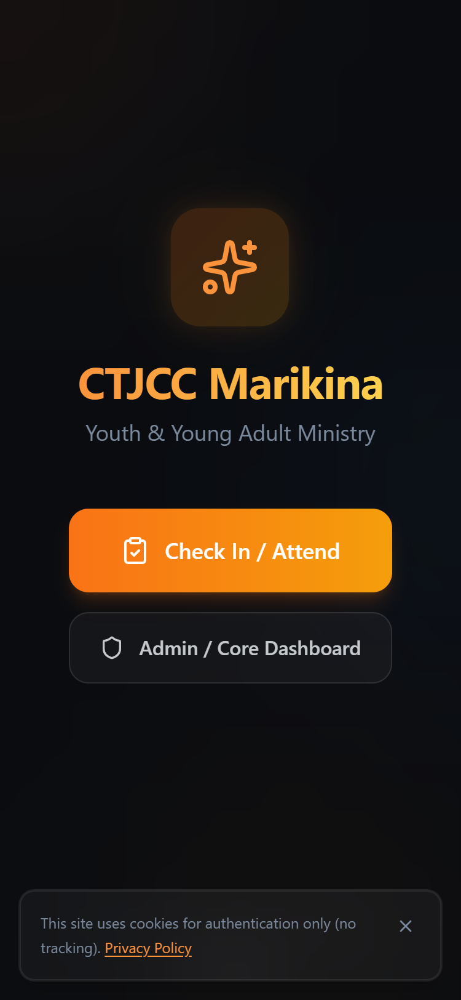 | 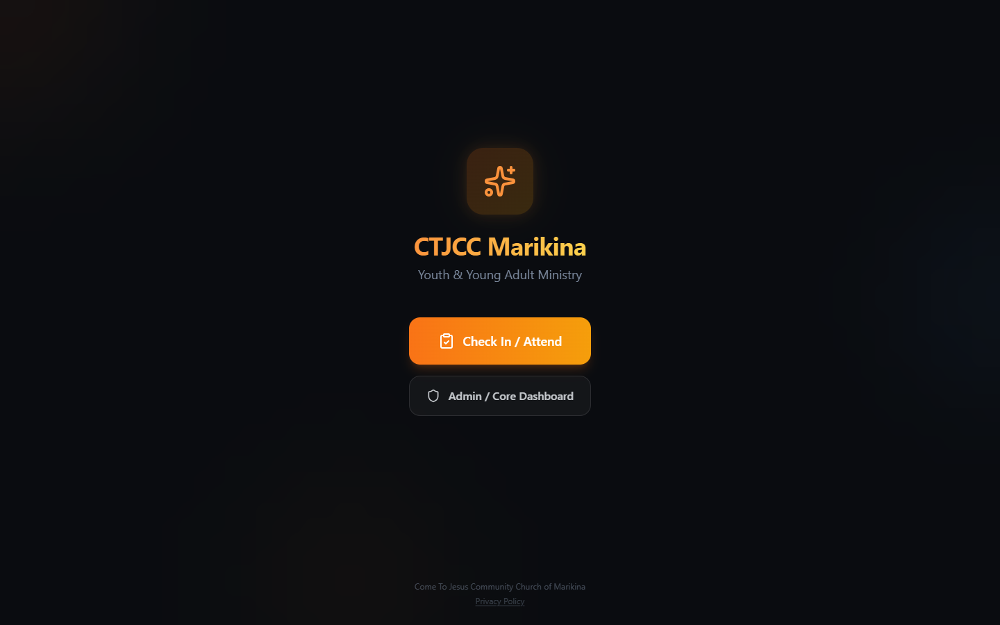 |
| 2 | Event picker | 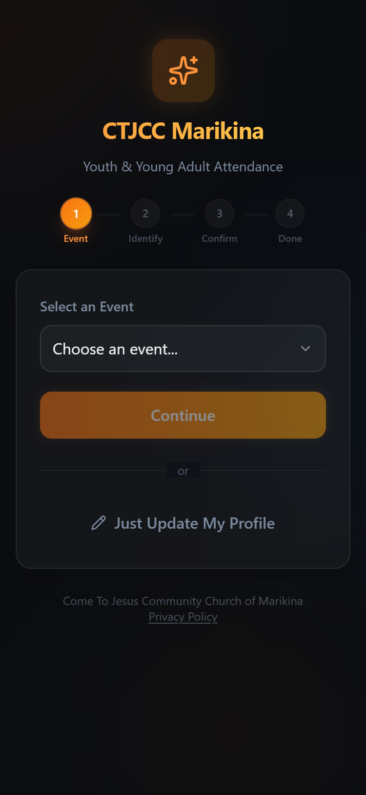 | 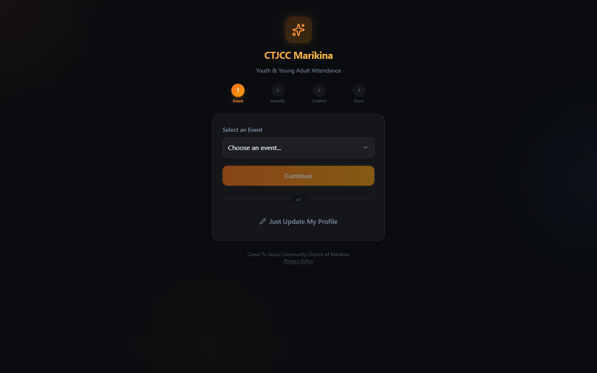 |
| 3 | Email lookup | 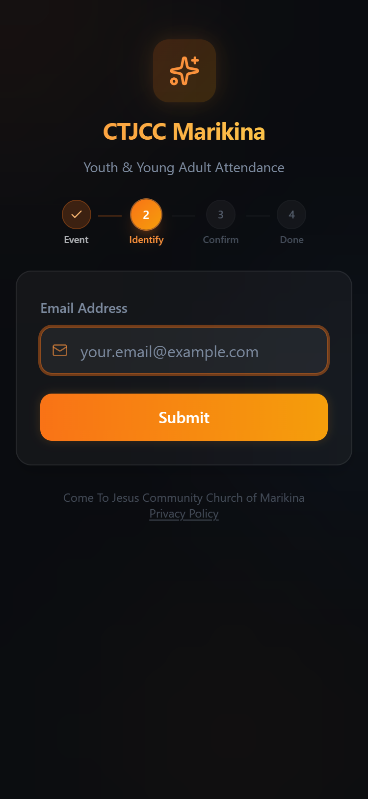 | 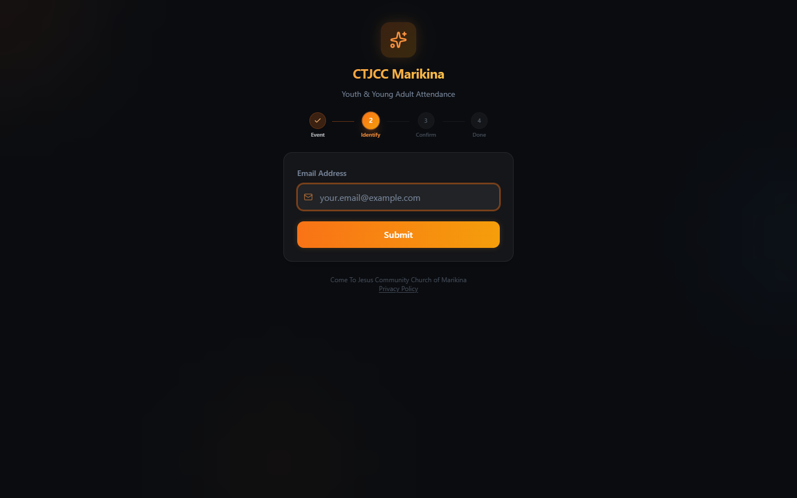 |
| 4 | Registration form | 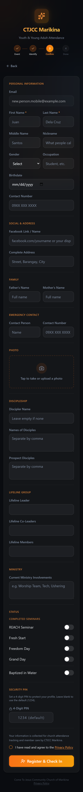 | 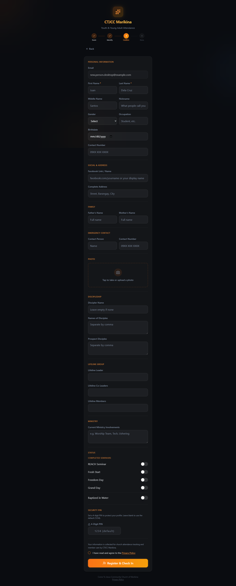 |
| 5 | PIN entry | 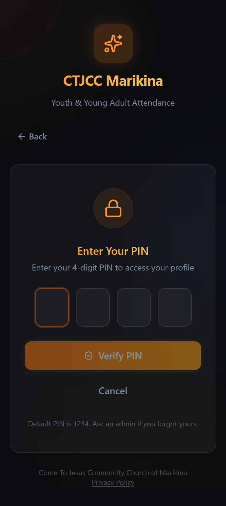 | 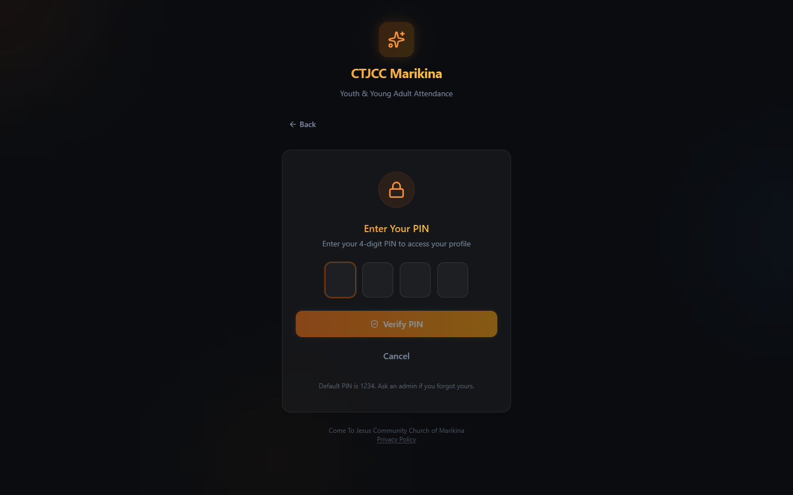 |
| 6 | Success screen | 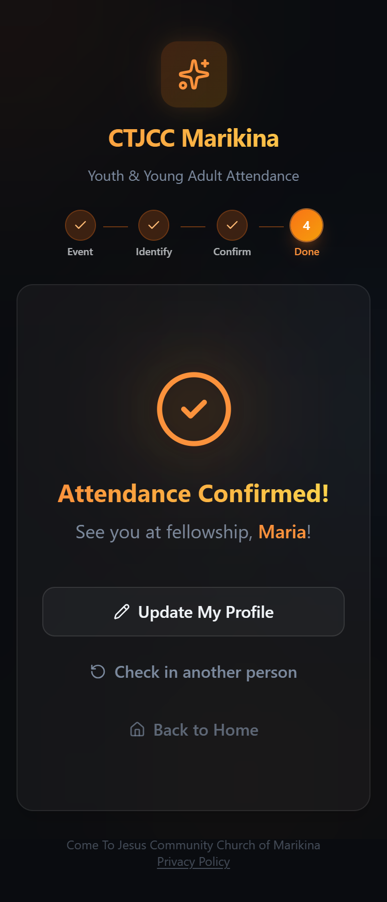 | 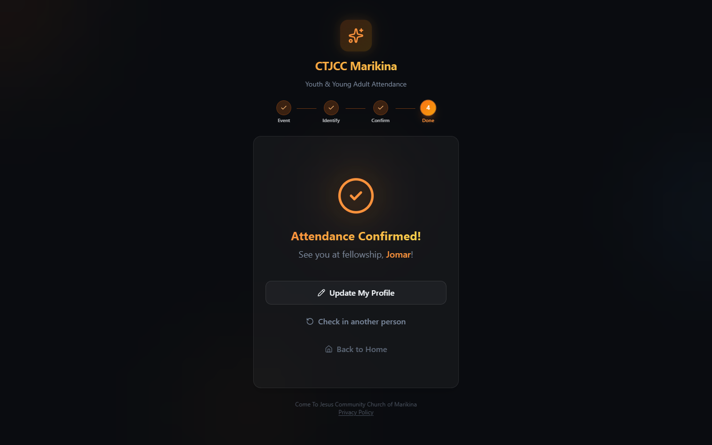 |
| 7 | Admin login | 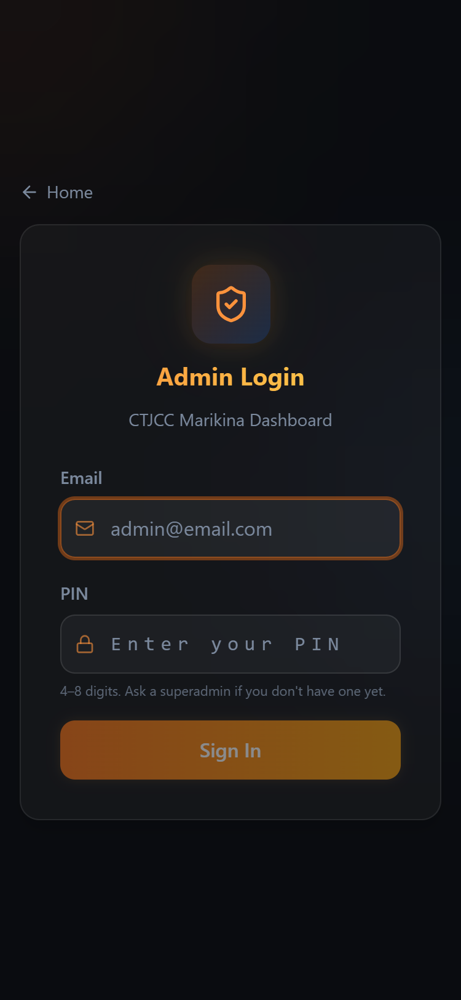 | 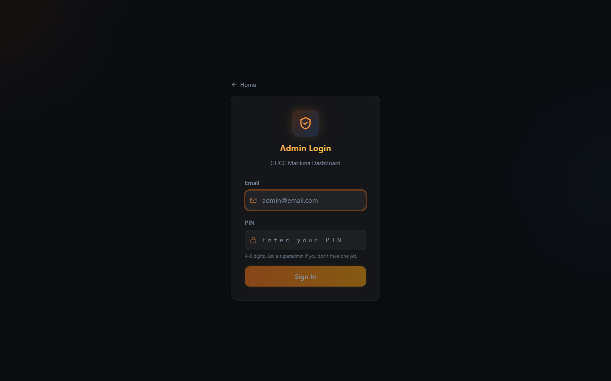 |
| 8 | Admin dashboard | 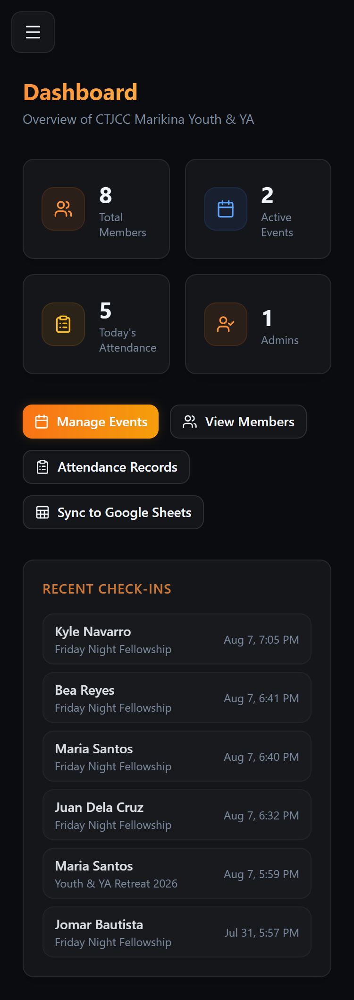 | 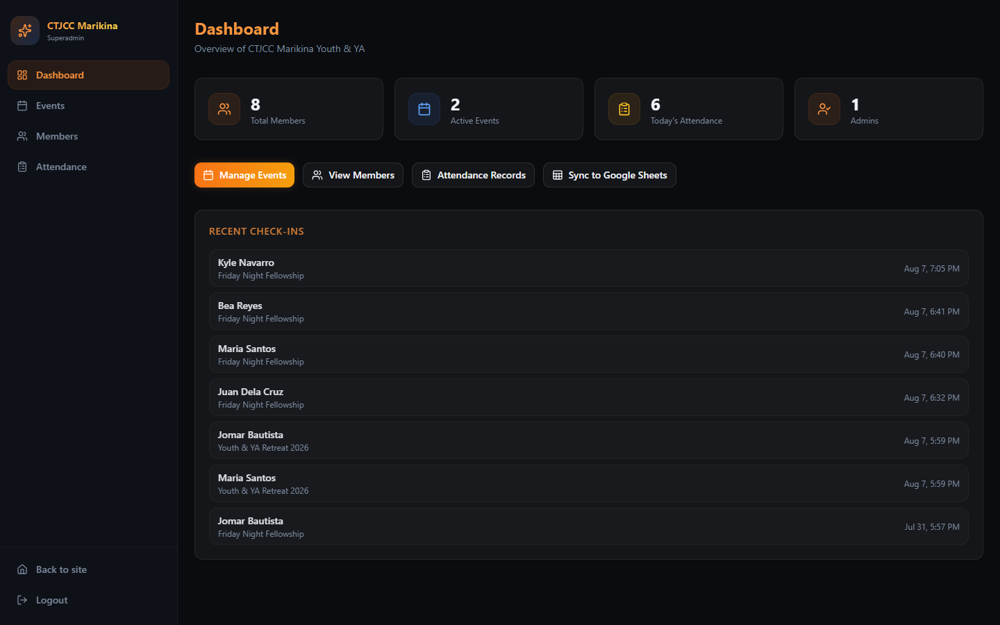 |
| 9 | Member roster | 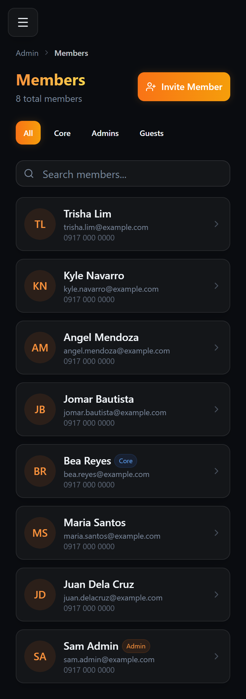 | 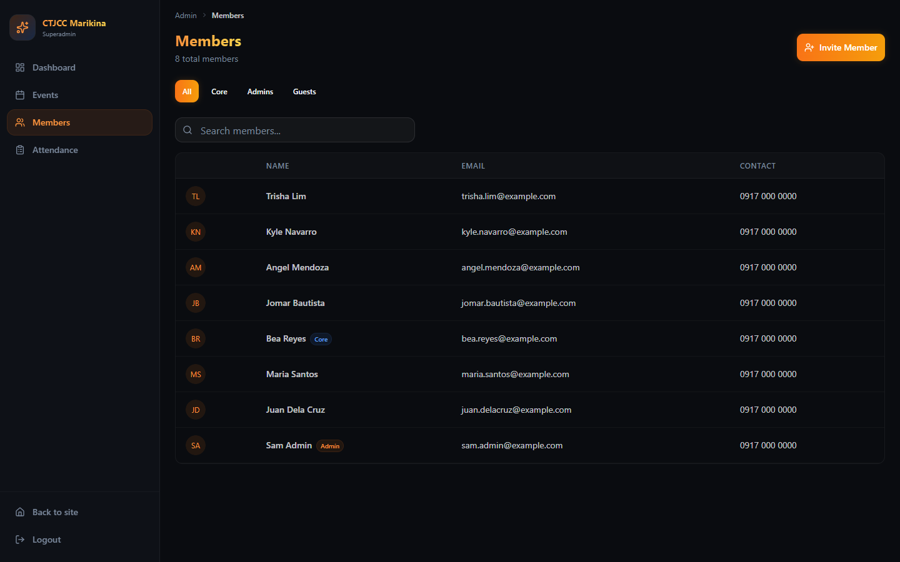 |

---

## Executive summary

The app is **functionally solid on mobile** — big touch targets, 16px inputs (no iOS zoom), auto-advancing PIN boxes, a clear step indicator, reduced-motion support. The craft level is genuinely above average for a volunteer-built tool.

The two structural problems:

1. **Every primary button fails WCAG contrast.** White text on the orange/amber gradient measures **2.15–2.80:1** against a 4.5:1 requirement (3:1 even for large text). This is the single most-repeated element in the app — every CTA on every screen fails. The near-black + hot-orange scheme is not inherently inaccessible (orange text *on* the dark background passes at 7.5–8.7:1); the failure is specifically **light text on orange fills**.

2. **The visual identity is a mismatch for the stated brand.** The honest read: glassmorphism cards, neon glow shadows, floating blurred orbs, and a sparkle logomark read as **streaming service / gaming / fintech**, not as a church youth ministry. Details compound it (a 🤘 "metal horns" icon on the check-in avatar, "Superadmin" in the sidebar). Nothing in the visual language says *church*, *community*, or *Philippines* except the footer text. For a 13-year-old opening this in front of a parent, the app looks like a game or betting app at first glance — the parent has to read the fine print to learn otherwise.

The registration form is the biggest **task-level** risk: ~4.4 phone-screens of scrolling and 30+ visible fields, including internal discipleship jargon, shown to every first-time registrant. For the planned retreat QR flow this is the page strangers will land on.

---

## Critical

### C1 — Primary button text fails WCAG AA contrast (all screens)
White `#FFFFFF` text on the button fills measures:
- on `--primary` `#F38320` (default Button): **2.60:1**
- on the `orange-500 → amber-500` gradient (gradient Button): **2.80 → 2.15:1** (midpoint 2.46:1)

WCAG 2.1 AA requires 4.5:1 for normal text, 3:1 for large/bold text — these fail both. Affected: "Check In / Attend" (screen 1), "Continue" (2), "Submit" (3), "Register & Check In" (4), "Verify PIN" (5), "Sign In" (7), "Manage Events" (8), "Invite Member" (9) — i.e., the main action of every screen. Low-quality phone screens in bright Philippine daylight make this materially worse than it looks on a designer's monitor. Disabled states add `opacity-50` on top, dropping further. Fix direction (for the redesign, not now): near-black text on orange (`#0A0C10` on `#F38320` ≈ 7.0:1) or darker fills.

### C2 — Registration form is ~4.4 phone-screens long with 30+ fields (screen 4)
Measured height at 375px width: **~3,566 CSS px ≈ 4.4 full screens of scrolling**. A first-time registrant (the retreat QR audience) sees: Personal Information (9 fields), Social & Address (2), Family (2), Emergency Contact (2), Photo upload, **Discipleship (3), Lifeline Group (3), Ministry (1)** — insider jargon ("Discipler Name", "Prospect Disciples", "Lifeline Co-Leaders") presented to people who may be attending church for the first time — plus 5 seminar toggles, a PIN section, and finally the consent checkbox and submit button. Only First/Last Name carry a required asterisk; nothing tells the user the other ~28 fields are optional, so conscientious users (and 12-year-olds) will try to fill everything. This is the #1 drop-off risk for the Aug 30 retreat pre-registration flow.

### C3 — The UI advertises the security bypass: "Default PIN is 1234" (screens 4, 5)
The PIN entry screen prints "**Default PIN is 1234.** Ask an admin if you forgot yours." — a public instruction for opening any profile whose owner never changed their PIN (most of them, since the PIN field during registration is optional and labeled "1234 (default)"). The PIN gates the full PII profile (birthday, address, family, contact number). This is a UX finding *and* the Batch 3 security finding surfacing in copy: the interface teaches the exploit. Any redesign of these screens should assume Batch 3 (hashing, lockout, no shared default) lands and the copy changes with it.

### C4 — Form fields are nearly invisible: borders fail non-text contrast (screens 3, 4, 5, 7)
Input/card borders are `white/[0.1]` over near-black, measuring **1.26–1.31:1** against the WCAG 1.4.11 requirement of **3:1** for UI component boundaries. Empty fields on the registration form are distinguishable from the background only by a barely-visible outline; in sunlight (retreat check-in is outdoors/daytime) fields will effectively disappear. The focused state (orange ring) is fine — the problem is finding the *unfocused* fields.

---

## Should-fix

### S1 — Visual identity: reads as dark-mode SaaS/nightclub, not church youth ministry (all screens)
Specific observations, for the design exploration:
- **Logomark is a generic `Sparkles` icon** (lucide) in a glowing tile — no cross, no church logo, no reference to CTJCC's actual identity. The same sparkle repeats in the admin sidebar.
- **The check-in avatar badge is `HandMetal`** — the 🤘 rock-horns gesture (screen: welcome-back, visible before screen 6). On a church app used by minors in front of parents, this is the single most likely element to be misread.
- **Aesthetic stack** — glass cards (`bg-white/4% + backdrop-blur-xl`), orange neon glow shadows, three floating blurred orbs animating in the background, gradient text on headings — is the visual language of streaming/gaming/crypto products circa 2024. It's executed *consistently*, which is why it convincingly reads as the wrong genre.
- **Nothing localizes it**: no photography of the actual community, no Filipino text, church name only in 12px footer text at 2.2:1 contrast (see S2).
- Counterpoint to keep: the 12–22 cohort may genuinely like the dark look, and it's battery-friendly on OLED. The problem is not "dark = bad" but that the identity communicates *entertainment product*, and warmth/trust cues are absent. A redesign can keep darkness and energy while swapping the genre signals (real logo, warmer palette, human imagery, honest typography).

### S2 — The de-emphasized text tiers fail contrast, including legally-relevant text (screens 1–7)
Measured: footer church name (`muted-foreground/50`) **2.22:1**; landing Privacy Policy link (`/40`) **1.81:1**; PIN hint (`/70`, 11px) **3.22:1**; "or" divider (`/60`) **2.67:1**. The Privacy Policy link — the one element NPC compliance cares about — is the least visible text in the app. Base `muted-foreground` itself passes (5.51:1); it's the extra opacity multipliers that break it.

### S3 — Placeholders truncate at 375px (screen 4)
"What people cal…" (Nickname), "facebook.com/yourname or your disp…" (Facebook). Cosmetic but visible on the most-used viewport, and placeholder-as-instruction disappears on first keystroke. Move instructions to helper text where they matter.

### S4 — Required/optional signaling and the consent control (screen 4)
Beyond C2's length problem: the consent checkbox is a 16×16px target (`h-4 w-4`) with small-text label, at the very bottom of the scroll, after the user is exhausted. Guardian-consent for under-18s (planned for the retreat form) will need this pattern to carry legal weight — it needs to be a full-width, large-target, clearly-worded control, not a footnote.

### S5 — Geist fonts are loaded but never applied (all screens)
`app/layout.tsx` loads GeistVF.woff and GeistMonoVF.woff and sets `--font-geist-sans` / `--font-geist-mono` variables — but `tailwind.config.ts` defines no `fontFamily`, and no class ever references the variables. Every screen renders in the OS default stack (Segoe UI on Windows, Roboto on Android, SF on iOS), and the font files are downloaded for nothing — pure wasted bytes on weak connections. Either apply the font or delete the files; for the redesign this means **the current typography you see is accidental**, and the design tool should not assume Geist.

### S6 — Photo upload sends raw camera files (screen 4; retreat plan)
`registration-form.tsx` and `edit-profile.tsx` upload the chosen file as-is. A modern phone camera photo is 3–12 MB; on weak signal this stalls or fails silently (the form treats upload failure as a warning and proceeds). The planned YA baby-photo upload for the retreat will inherit this. Client-side downscale/compression before upload is a small, isolated fix and matters more than any visual change for the weak-signal audience.

### S7 — Ambiguous disabled state (screen 2)
The disabled "Continue" is the same gradient at 50% opacity — on a dark screen it still looks somewhat tappable, and its text contrast drops to ~1.3:1. Users on the event picker may tap it repeatedly before realizing they must select an event first.

### S8 — Microcopy inconsistencies (screens 2, 3, 4, 7)
Overall the voice is good — "Welcome back!", "See you at fellowship, Maria!", "Looking you up…" are warm and human. Inconsistencies: **"Submit"** (screen 3) is the one generic label in the flow (should say what happens — "Continue" / "Find me"); step 3 of the indicator is labeled **"Confirm"** while the user is *filling a form* (screen 4); **"Ask a superadmin"** (admin login) leaks internal jargon; **"Just Update My Profile"** vs "Edit My Profile" vs "Update My Profile" — three names for one action across screens 2, welcome-back, and 6. The registration CTA "Register & Check In" is honest today but will be wrong for the retreat's pre-registration mode (you're not checking in on Aug 9) — copy will need a mode-aware variant.

### S9 — Screen-reader gaps on the PIN inputs and icon-only controls (screens 5, 8, 9)
The four PIN digit inputs have no accessible labels (nothing announces "PIN digit 1 of 4"); the mobile admin hamburger and the roster's chevron-only row buttons rely on icon meaning alone. The success screen does it right (`role="status" aria-live="polite"`) — extend that standard. Also credit: `prefers-reduced-motion` is respected globally, and focus rings are consistently visible.

### S10 — The guest path is only discoverable after a failed email lookup (screen 3)
"I'm a Guest" appears only after typing an email that isn't found. A walk-in guest who *has* no email they want to give, or a first-timer confused at the email prompt, has no visible path. For the retreat's walk-in flow this becomes a front-line problem: consider surfacing the guest/walk-in option earlier when designing the day-of screen.

---

## Nice-to-have

- **N1 — Success screen lacks event context** (screen 6): "Attendance Confirmed!" doesn't say *which event* or show a timestamp. Kids show this screen to leaders as proof; event name + time would make it verifiable at a glance.
- **N2 — Localization warmth**: everything is in English. The existing tone ("See you at fellowship") is good; a redesign could test light Taglish for the youth-facing flow. Also: birthdate input renders `mm/dd/yyyy`; PH habit is day-first, so consider explicit month names in the redesign. Contact placeholder `09XX XXX XXXX` is correctly localized — keep that.
- **N3 — Landing page doesn't say what the app is** (screen 1): a parent looking over a shoulder sees a glowing sparkle and two buttons. One plain sentence ("Attendance and events for CTJCC Marikina's youth ministry") would ground it.
- **N4 — Tiny type tiers**: 21 uses of `text-[10px]`/`text-[11px]` (sidebar role label, PIN hint, badges). Sub-12px text on low-DPI Android phones is a strain; the redesign's type scale should bottom out at 12px.
- **N5 — Desktop is a stretched phone column** (screens 2–6 desktop): the attend flow floats a `max-w-md` column in a large dark void. Acceptable — the flow is phone-first by design — but the admin dashboard (screen 8 desktop) shows the app *can* use width well; a redesign could give the desktop attend flow the same treatment for the volunteers who run it from laptops.
- **N6 — GPU-heavy decoration on low-end phones**: three permanently-animating blurred orbs + `backdrop-blur-xl` on every card is a real cost on ₱5k Android phones. Reduced-motion users are already exempted (good); consider making the orbs static below a device-memory/width threshold in the redesign.

---

## What's working — keep these in any redesign

- Touch targets: primary CTAs are 48–52px tall, comfortably above the 44px floor.
- `text-base` (16px) on all inputs — no iOS focus-zoom.
- PIN entry: auto-focus, auto-advance, backspace-to-previous, paste handling, numeric keyboard (`inputMode="numeric"`), shake feedback on error.
- Step indicator with labels + checkmarks — orientation without reading.
- Idempotent check-in ("already checked in" is treated as success, not an error).
- `prefers-reduced-motion` disables all decorative animation.
- Error text (`red-400` on dark: 7.08:1) and main orange-on-dark text (7.5–8.7:1) pass contrast comfortably.
- Consistent focus-visible rings everywhere.
- The admin mobile layout genuinely works at 375px (cards, not squeezed tables).

---

## Appendix A — Measured contrast ratios (WCAG 2.1)

Pass thresholds: 4.5:1 normal text, 3:1 large text (≥24px or ≥19px bold), 3:1 non-text UI boundaries (WCAG 1.4.11).

| Pair | FG | BG | Ratio | Verdict |
|------|----|----|-------|---------|
| Body text on background | `#F1F5F9` | `#0A0C10` | 17.87 | Pass |
| Body text on card | `#F1F5F9` | `#0F131A` | 16.99 | Pass |
| Muted text on background | `#7B899D` | `#0A0C10` | 5.51 | Pass |
| Muted text on card | `#7B899D` | `#0F131A` | 5.24 | Pass |
| Muted @70% (PIN hint, 11px) | `#596373` | `#0A0C10` | 3.22 | **Fail** |
| Muted @60% ("or" divider) | `#505A69` | `#0F131A` | 2.67 | **Fail** |
| Muted @50% (footer) | `#434B57` | `#0A0C10` | 2.22 | **Fail** |
| Muted @40% (privacy link) | `#373E48` | `#0A0C10` | 1.81 | **Fail** |
| White on `--primary` (default button) | `#FFFFFF` | `#F38320` | 2.60 | **Fail** |
| White on orange-500 (gradient start) | `#FFFFFF` | `#F97316` | 2.80 | **Fail** |
| White on amber-500 (gradient end) | `#FFFFFF` | `#F59E0B` | 2.15 | **Fail** |
| White on gradient midpoint | `#FFFFFF` | `#F78911` | 2.46 | **Fail** |
| Orange-400 links/accents on background | `#FB923C` | `#0A0C10` | 8.65 | Pass |
| Gradient heading text (midpoint) on background | `#FCB345` | `#0A0C10` | 10.88 | Pass |
| `--primary` on background (link variant) | `#F38320` | `#0A0C10` | 7.53 | Pass |
| Error text on background | `#F87171` | `#0A0C10` | 7.08 | Pass |
| White on destructive | `#FFFFFF` | `#DC2828` | 4.80 | Pass |
| White on accent blue | `#FFFFFF` | `#1F5FAD` | 6.37 | Pass |
| Secondary-fg on secondary | `#DBE6F0` | `#21242C` | 12.26 | Pass |
| Placeholder on input fill | `#7B899D` | `#191C23` | 4.80 | Pass |
| Card border vs card (non-text, needs 3:1) | `#272B31` | `#0F131A` | 1.31 | **Fail** |
| Input border vs background (non-text) | `#232428` | `#0A0C10` | 1.26 | **Fail** |
| `--border` token vs background (non-text) | `#212731` | `#0A0C10` | 1.30 | **Fail** |

## Appendix B — Reproduction

Screenshots were produced by `puppeteer-core` driving headless Chrome against `next dev` on this commit, with Supabase mocked by a local PostgREST-shim seeded with fictional data (so no production reads/writes and no real PII). Viewports: 375×812@2x with mobile emulation, and 1440×900@1x. `prefers-reduced-motion: reduce` was emulated so animated elements rendered at rest. Full-page captures; the registration form image is genuinely that tall.
